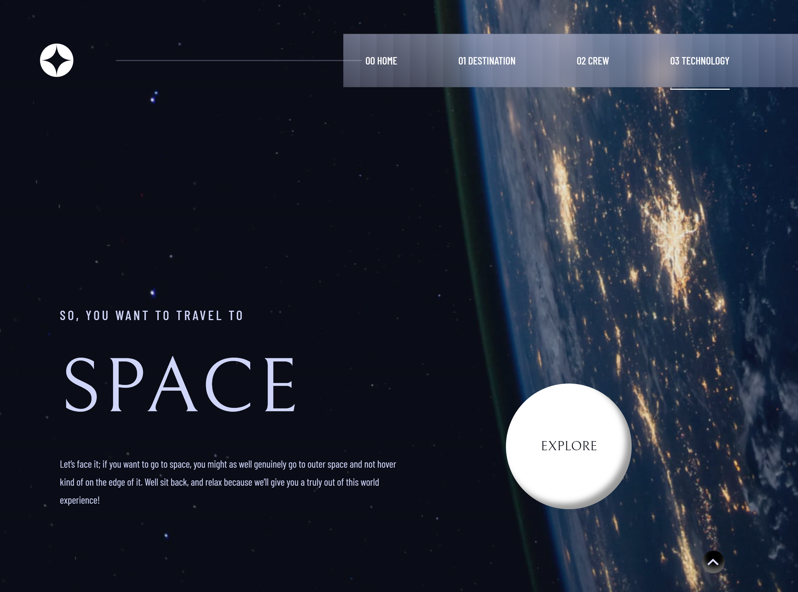

# Frontend Mentor | Space Tourism Website

This repository contains my solution to the Space Tourism Website challenge on Frontend Mentor. The project involves creating a modern, responsive website for a space tourism company with interactive elements and a sleek design.

## Table of Contents

- [Overview](#overview)
  - [Screenshot](#screenshot)
  - [Links](#links)
- [My Process](#my-process)
  - [Built With](#built-with)
  - [What I Learned](#what-i-learned)
  - [Continued Development](#continued-development)
  - [Useful Resources](#useful-resources)
- [Author](#author)
- [Acknowledgments](#acknowledgments)

## Overview

### Screenshot




### Links

- Solution URL: [Frontend Mentor Solution](https://www.frontendmentor.io/solutions/your-solution-url)
- Live Site URL: [Live Demo](https://your-github-username.github.io/your-repo-name)

## My Process

This project focuses on creating a visually engaging and interactive landing page for space tourism. Key features include a responsive layout, image sliders, and smooth navigation. The design leverages BEM (Block Element Modifier) methodology for CSS organization and vanilla JavaScript for interactive elements.

### Built With

- **Semantic HTML5 Markup:** Utilized semantic HTML elements to enhance accessibility and SEO.
- **CSS:** Employed custom properties (variables) for consistent styling, Flexbox and Grid for layout, and BEM for CSS structure.
- **JavaScript:** Implemented lazy loading for images and interactive features like sliders and navigation.

### BEM Methodology

In this project, BEM (Block Element Modifier) methodology was used to structure the CSS, improving maintainability and readability. Here’s how BEM was applied:

- **Block:** Represents the main components (e.g., `.main-crew`, `.main-tech`, `.slider`).
- **Element:** Represents a part of a block (e.g., `.main-crew__caption`, `.main-tech__slider-card`).
- **Modifier:** Represents variations or states of blocks or elements (e.g., `.main-crew--active`, `.slider__control--active`).

#### Example BEM Structure

- **Main Crew Block:**

  ```scss
  .main-crew {
    // Block styles

    &__caption {
      // Element styles
    }

    &__figure {
      // Element styles
    }

    &--active {
      // Modifier styles
    }
  }
  ```

- **Main Tech Block:**

  ```scss
  .main-tech {
    // Block styles

    &__slider-card {
      // Element styles
    }

    &__slider__caption {
      // Element styles
    }

    &--active {
      // Modifier styles
    }
  }
  ```

### What I Learned

Through this project, I enhanced my skills in:

- **HTML Semantics:** Structuring HTML to improve accessibility and SEO.
- **CSS Custom Properties:** Using CSS variables for dynamic and consistent styling.
- **SCSS:** Applying SCSS for modular and maintainable CSS.
- **BEM Methodology:** Organizing CSS with BEM for better readability and scalability.
- **JavaScript:** Implementing lazy loading and interactive features with vanilla JavaScript.
- **Responsive Design:** Utilizing Flexbox and CSS Grid for responsive layouts.

### Continued Development

Future updates may include:

- **Advanced JavaScript:** Implementing more sophisticated JavaScript techniques for improved performance.
- **Enhanced CSS Animations:** Adding complex animations and transitions to enrich user experience.
- **Accessibility Improvements:** Ensuring all interactive elements are fully accessible and improving keyboard navigation.

### Useful Resources

- [MDN Web Docs](https://developer.mozilla.org/en-US/) - Comprehensive documentation for web technologies.
- [CSS-Tricks](https://css-tricks.com/) - Articles and tutorials on modern CSS techniques.
- [Sass Documentation](https://sass-lang.com/documentation) - Official SCSS documentation.
- [JavaScript.info](https://javascript.info/) - In-depth JavaScript tutorials and guides.
- [Frontend Mentor](https://www.frontendmentor.io/) - Platform for frontend challenges and community feedback.

## Author

- **Frontend Mentor:** [@TheBeyonder616](https://www.frontendmentor.io/profile/@TheBeyonder616)
- **GitHub:** [@TheBeyonder616](https://github.com/TheBeyonder616)

## Acknowledgments

A special thanks to Frontend Mentor for providing this challenging project and to the community for their valuable feedback and support throughout the development process.
